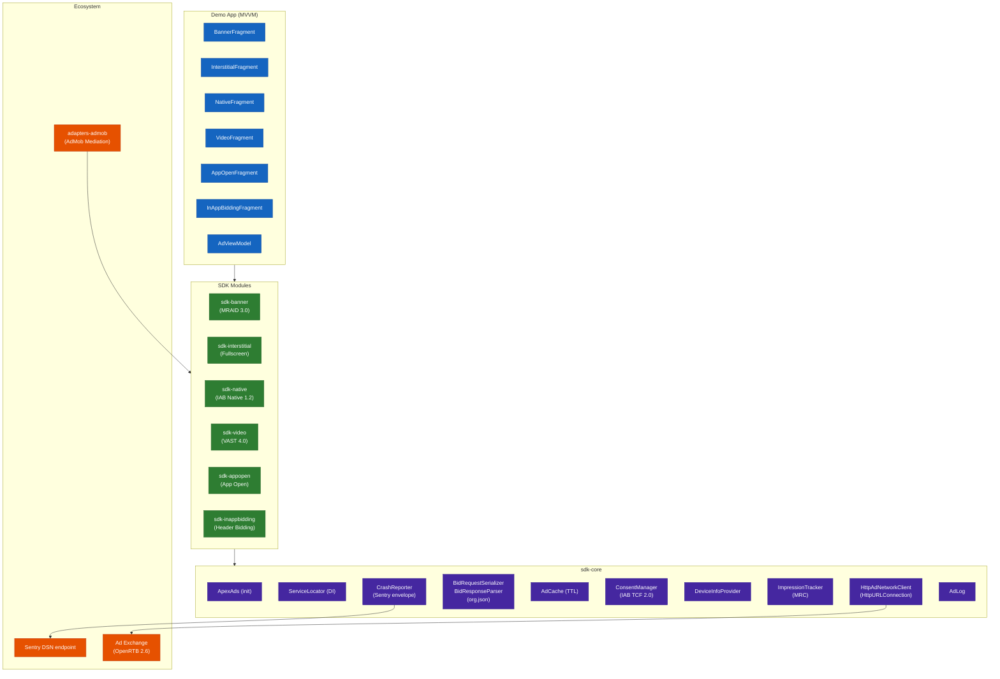
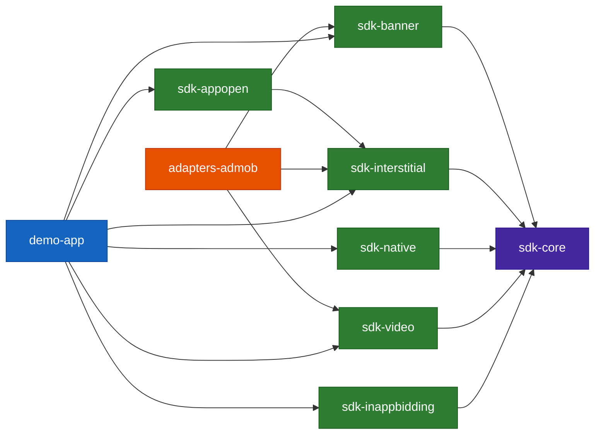
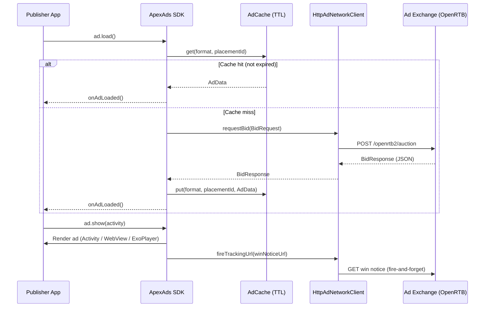
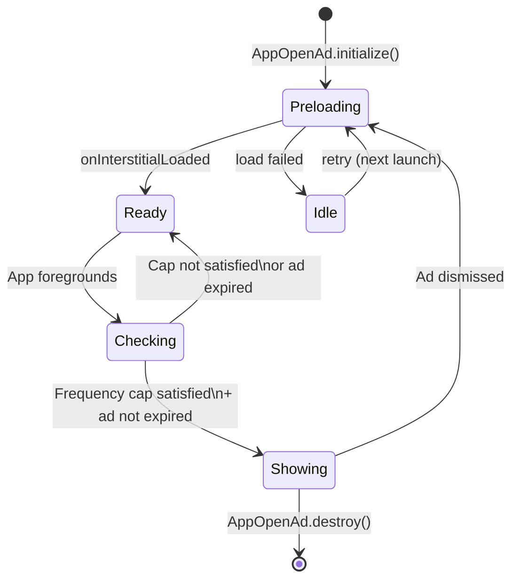

# ApexAd SDK — Android

> A production-grade programmatic advertising SDK demonstrating full-stack ad-tech engineering:
> OpenRTB 2.6 · VAST 4.0 · MRAID 3.0 · IAB Native 1.2 · IAB TCF 2.0 · App Open Ads · In-App Bidding · AdMob Mediation · In-House Crash Reporting · Custom DI · MRC Viewability

[](https://android-arsenal.com/api?level=21)
[](https://www.iab.com/guidelines/openrtb/)
[](https://www.iab.com/guidelines/vast/)
[](https://www.iab.com/guidelines/mraid/)
[](#zero-third-party-runtime-dependencies)
[](LICENSE)

---

## What Sets This SDK Apart

Most ad SDKs (including major ones from Google, Meta, Unity) share a common set of problems. ApexAds was designed to solve all of them out of the box:

| Feature | ApexAds | AdMob | MAX | IronSource / LevelPlay |
|---|:---:|:---:|:---:|:---:|
| App Open Ads (native SDK feature) | ✅ | ✅ | ❌ | ❌ |
| In-App / Header Bidding | ✅ | ❌ | ✅ (MAX) | ✅ (LevelPlay) |
| In-House Crash Reporting (no 3P SDK) | ✅ | ❌ | ❌ | ❌ |
| Custom Lightweight DI (no Hilt/Dagger) | ✅ | ❌ | ❌ | ❌ |
| Zero 3P Runtime Dependencies | ✅ | ❌ | ❌ | ❌ |
| AdMob Mediation Adapter | ✅ | — | ❌ | ❌ |
| MRC Viewability (frame-accurate) | ✅ | ✅ | ❌ | ❌ |
| MRAID 3.0 Rich Media | ✅ | ❌ | ❌ | ❌ |
| VAST 4.0 Rewarded Video | ✅ | ✅ | ✅ | ✅ |
| IAB TCF 2.0 Consent | ✅ | ✅ | ❌ | ❌ |
| IAB Native 1.2 | ✅ | ❌ | ❌ | ❌ |

### Differentiator Deep-Dives

#### 1. App Open Ads — Only the second SDK to offer this natively
Google AdMob introduced App Open as a dedicated ad format in 2021. No other Android ad SDK has followed. ApexAds implements the full lifecycle — background detection, frequency capping, automatic preload and re-preload after dismiss — backed by the same OpenRTB pipeline as every other format.

```kotlin
// Application.onCreate()
AppOpenAd.initialize(this, "placement-appopen", object : AppOpenAd.Listener {
    override fun onAppOpenAdLoaded()  { /* ad is warm */ }
    override fun onAppOpenAdDismissed() { /* user dismissed */ }
    override fun onAppOpenAdFailedToLoad(error: AdError) { /* handle */ }
})
AppOpenAd.setFrequencyCapHours(1)   // show at most once per hour
AppOpenAd.setAdExpiryMinutes(30)    // discard stale cached ad after 30 min
```

#### 2. In-House Crash Reporting — Zero Sentry SDK dependency
Crash events are serialized to the Sentry envelope protocol and delivered via raw `HttpURLConnection` — no Sentry Android SDK on the classpath. The reporter installs a `Thread.UncaughtExceptionHandler`, retries delivery up to 3× with exponential back-off, and respects 429 rate limits.

```kotlin
ApexAdsConfig.Builder("APP_TOKEN")
    .sentryDsn("https://key@o123.ingest.sentry.io/project")
    .build()
// ↑ crash reporting is fully automatic after this. No other wiring needed.
```

#### 3. Custom DI — No Hilt, No Dagger, No Koin
Annotation processors from DI frameworks conflict with host app DI graphs and slow incremental builds. `ServiceLocator` is a `ConcurrentHashMap<Class, Any>` — 40 lines of code, zero reflection at runtime, zero transitive deps.

```kotlin
// SDK registers its own services at init time:
ServiceLocator.register(AdNetworkClient::class.java, HttpAdNetworkClient(config))
// Any module resolves them without knowing the concrete class:
val client = ServiceLocator.get(AdNetworkClient::class.java)
// Test code swaps in a mock with one line:
ServiceLocator.register(AdNetworkClient::class.java, MockAdExchange())
```

#### 4. Zero 3P Runtime Dependencies
Every SDK imported into a publisher app risks version conflicts with the publisher's own dependencies. ApexAds runtime uses only Android platform APIs:

| Replaced | With |
|---|---|
| OkHttp | `java.net.HttpURLConnection` |
| Gson | `org.json.JSONObject` (built into Android) |
| Timber | Custom `AdLog` over `android.util.Log` |
| Sentry SDK | Raw HTTP envelope protocol over `HttpURLConnection` |
| Hilt / Dagger | `ServiceLocator` (40-line `ConcurrentHashMap` wrapper) |

---

## Architecture Overview



---

## Module Dependency Graph



| Module | Depends On | Responsibility |
|---|---|---|
| `sdk-core` | — (Android platform only) | SDK init, OpenRTB models, HTTP networking, ad cache, consent, DI, crash reporting, logging |
| `sdk-banner` | `sdk-core` | Banner ad + MRAID 3.0 WebView container |
| `sdk-interstitial` | `sdk-core` | Fullscreen HTML interstitial, separate Activity |
| `sdk-native` | `sdk-core` | IAB Native 1.2 JSON parsing, publisher-controlled view binding |
| `sdk-video` | `sdk-core` | VAST 4.0 parsing, ExoPlayer rewarded video, quartile tracking |
| `sdk-appopen` | `sdk-interstitial` | App Open Ads — foreground detection, frequency cap, auto-preload |
| `sdk-inappbidding` | `sdk-core` | Header bidding price signals, MAX/LevelPlay mock simulation |
| `adapters-admob` | `sdk-banner`, `sdk-interstitial`, `sdk-video` | AdMob mediation adapter (Banner, Interstitial, Rewarded) |
| `demo-app` | all modules | MVVM showcase app, MockAdExchange integration |

---

## Ad Request Lifecycle



---

## App Open Ad Lifecycle



---

## Ad Tech Standards Implemented

### OpenRTB 2.6 (IAB)
Full bid request/response object graph — `BidRequest`, `Impression`, `Banner`, `Video`, `Native`, `App`, `Device`, `User`, `Regs`, `Geo`, and all extension objects. Serialized to JSON with hand-written `org.json` serializer (no Gson/Moshi).

```kotlin
val request = OpenRTBRequestBuilder(deviceInfoProvider, consentManager)
    .adFormat(AdFormat.BANNER)
    .adSize(AdSize.BANNER_320x50)
    .placementId("placement-001")
    .bidFloor(0.50)
    .build()
// → POSTs JSON to ad exchange endpoint, parses BidResponse
```

### MRAID 3.0 (IAB)
Full JavaScript bridge injected into ad WebViews. Implements `mraid.close()`, `mraid.expand()`, `mraid.resize()`, `mraid.open()`, `mraid.getState()`, `mraid.isViewable()`, `mraid.supports()`, and all lifecycle events.

### VAST 4.0 (IAB)
Pure-Java XML parser handles Inline and Wrapper VAST. Quartile tracking events (start, 25%, 50%, 75%, complete) fire automatically via ExoPlayer position polling every 500ms.

### IAB TCF 2.0 / GDPR
Reads `IABTCF_TCString`, `IABTCF_gdprApplies`, and `IABUSPrivacy_String` from SharedPreferences — the standardised keys written by any compliant CMP. Consent signals are auto-wired into `Regs` and `User` OpenRTB objects.

### MRC Viewability Standard
`ImpressionTracker` attaches a `ViewTreeObserver.OnPreDrawListener` to measure visible pixel ratio every frame. Impression fires only when ≥50% of pixels are in-view for ≥1 continuous second. Properly cleans up the listener on view detach (memory-safe).

### In-App Bidding / Header Bidding
`ApexInAppBidder` fetches a real-time bid from the exchange and packages it as a `BidToken` price signal — compatible with MAX and LevelPlay's `setLocalExtraParameter` / `setSignal` patterns.

---

## Project Structure

```
apex-ad-sdk-android/
│
├── sdk-core/                          # Zero 3P runtime deps — Android platform APIs only
│   └── com/apexads/sdk/
│       ├── ApexAds.java               # SDK singleton entry point
│       ├── ApexAdsConfig.java         # Immutable builder-pattern configuration
│       └── core/
│           ├── di/ServiceLocator      # Lightweight ConcurrentHashMap DI (40 lines)
│           ├── network/
│           │   ├── AdNetworkClient    # Interface (2 methods)
│           │   ├── HttpAdNetworkClient# HttpURLConnection impl (no OkHttp)
│           │   ├── SdkHttpClient      # Raw HTTP helper
│           │   ├── BidRequestSerializer  # org.json serializer (no Gson)
│           │   └── BidResponseParser     # org.json parser
│           ├── models/openrtb/        # Full OpenRTB 2.6 POJO graph
│           ├── request/OpenRTBRequestBuilder
│           ├── cache/AdCache          # Thread-safe TTL-based ad cache
│           ├── consent/ConsentManager # IAB TCF 2.0 SharedPreferences reader
│           ├── device/DeviceInfoProvider
│           ├── tracking/ImpressionTracker  # MRC viewability (frame-accurate)
│           ├── crashreporter/         # In-house Sentry envelope reporter
│           │   ├── SentryDsn          # DSN parser → envelope URL
│           │   ├── CrashEvent         # Sentry envelope serializer (no Sentry SDK)
│           │   ├── CrashDelivery      # HTTP POST, 3× retry, 429-aware
│           │   └── CrashReporter      # UncaughtExceptionHandler installer
│           ├── error/AdError          # Typed error sealed hierarchy
│           └── utils/AdLog            # android.util.Log wrapper (no Timber)
│
├── sdk-banner/                        # Banner + MRAID 3.0
│   └── BannerAd / BannerAdView / mraid/MRAIDBridge
│
├── sdk-interstitial/                  # Fullscreen interstitial
│   └── InterstitialAd / InterstitialActivity
│
├── sdk-native/                        # IAB Native 1.2
│   └── NativeAd / NativeAdParser (org.json) / NativeAdView
│
├── sdk-video/                         # VAST 4.0 rewarded video
│   └── VideoAd / VideoAdActivity / vast/VastParser
│
├── sdk-appopen/                       # App Open Ads  ◀ unique to ApexAds
│   └── AppOpenAd              # Public static facade
│   └── AppOpenAdManager       # Singleton lifecycle manager
│   └── AppOpenAdFrequencyCap  # SharedPreferences frequency cap
│
├── sdk-inappbidding/                  # Header bidding / in-app bidding
│   └── ApexInAppBidder / BidToken / InAppBidListener
│   └── mock/MockMediationPlatform     # Simulates MAX/LevelPlay waterfall
│
├── adapters-admob/                    # AdMob mediation adapters
│   └── ApexAdsAdMobAdapter    # Main entry point (extends Adapter)
│   └── ApexAdsBannerAdapter / ApexAdsInterstitialAdapter / ApexAdsRewardedAdapter
│
└── demo-app/                          # MVVM showcase (no live server needed)
    └── DemoApplication        # SDK init + MockAdExchange + AppOpenAd
    └── ui/banner / interstitial / native / video / appopen / inappbidding
```

---

## Integration Guide

### 1. Initialize the SDK

```kotlin
// Application.onCreate()
ApexAds.init(this, ApexAdsConfig.Builder("YOUR_APP_TOKEN")
    .adServerUrl("https://your-openrtb-endpoint.com/auction")
    .cacheTtlSeconds(300)
    .gdprConsentString(tcfString)
    .sentryDsn("https://key@o123.ingest.sentry.io/project") // optional crash reporting
    .build())
```

### 2. App Open Ads

```kotlin
// Application.onCreate() — fires automatically on every background→foreground
AppOpenAd.initialize(this, "placement-appopen", listener)
AppOpenAd.setFrequencyCapHours(1)
AppOpenAd.setAdExpiryMinutes(30)
```

### 3. Banner

```xml
<com.apexads.sdk.banner.BannerAdView
    android:id="@+id/banner_ad_view"
    android:layout_width="320dp"
    android:layout_height="50dp" />
```

```kotlin
val banner = BannerAd.Builder("placement-banner")
    .adSize(AdSize.BANNER_320x50)
    .listener(object : BannerAdListener {
        override fun onAdLoaded() = banner.show(bannerAdView)
        override fun onAdFailed(error: AdError) = handleError(error)
    }).build()
banner.load()
```

### 4. Interstitial

```kotlin
val interstitial = InterstitialAd.Builder("placement-interstitial")
    .listener(object : InterstitialAdListener {
        override fun onInterstitialLoaded() { /* show at natural pause */ }
        override fun onInterstitialFailed(error: AdError) = handleError(error)
    }).build()
interstitial.load()
// at a content transition:
if (interstitial.isReady()) interstitial.show(activity)
```

### 5. Rewarded Video

```kotlin
val video = VideoAd.Builder("placement-video")
    .listener(object : VideoAdListener {
        override fun onVideoAdLoaded()  { showButton.isEnabled = true }
        override fun onRewardEarned()   { grantReward() }
        override fun onVideoAdFailed(error: AdError) = handleError(error)
    }).build()
video.load()
```

### 6. Native

```kotlin
val native = NativeAd.Builder("placement-native")
    .listener(object : NativeAdListener {
        override fun onNativeAdLoaded(ad: NativeAd) = ad.bindTo(nativeAdView)
        override fun onNativeAdFailed(error: AdError) = handleError(error)
    }).build()
native.load()
```

### 7. In-App Bidding (Header Bidding)

```kotlin
// Call before loading your mediation ad:
ApexInAppBidder.fetchBidToken("placement-001", AdFormat.INTERSTITIAL, object : InAppBidListener {
    override fun onBidReady(token: BidToken) {
        // Pass price signal to MAX / LevelPlay:
        maxAd.setLocalExtraParameter("apex_bid_token", token.token)
        maxAd.setLocalExtraParameter("apex_bid_cpm", token.cpmUsd.toString())
        maxAd.loadAd()
    }
    override fun onBidFailed(error: AdError) = maxAd.loadAd() // waterfall fallback
})
```

### 8. AdMob Mediation

Configure in the AdMob dashboard:
- **Class name:** `com.apexads.sdk.adapters.admob.ApexAdsAdMobAdapter`
- **Server parameters:** `{"placementId":"your-id","appToken":"your-token"}`

No additional code needed — AdMob calls the adapter automatically.

---

## Demo App

The demo app uses `MockAdExchange` — an in-process OpenRTB mock that returns realistic bid responses. No backend setup, API key, or network required.

| Tab | Format | Demonstrates |
|---|---|---|
| Banner | 320×50 HTML + MRAID | OpenRTB auction → MRAID 3.0 WebView → MRC viewability |
| Interstitial | Fullscreen HTML | Pre-load / show lifecycle, MRAID close, separate Activity |
| Native | IAB Native 1.2 | OpenRTB native request, org.json asset parsing, publisher layout |
| Video | VAST 4.0 Rewarded | VAST parsing, ExoPlayer, quartile tracking, skip button, reward |
| App Open | Fullscreen Interstitial | Background→foreground detection, frequency cap, auto-preload |
| In-App Bidding | Price signal | Header bidding token → mock MAX/LevelPlay waterfall auction |

```bash
git clone https://github.com/Madroid2/apex-ad-sdk-android.git
cd apex-ad-sdk-android
./gradlew :demo-app:installDebug
```


---

## Standards & References

| Standard | Version | Reference |
|---|---|---|
| OpenRTB | 2.6 | [IAB OpenRTB 2.6](https://www.iab.com/wp-content/uploads/2022/04/OpenRTB-2-6_FINAL.pdf) |
| VAST | 4.0 | [IAB VAST 4.0](https://www.iab.com/guidelines/vast/) |
| MRAID | 3.0 | [IAB MRAID 3.0](https://www.iab.com/guidelines/mraid/) |
| OpenRTB Native | 1.2 | [IAB Native Ads API](https://www.iab.com/guidelines/openrtb-native-ads-api-specification-version-1-2/) |
| TCF | 2.0 | [IAB TCF 2.0](https://github.com/InteractiveAdvertisingBureau/GDPR-Transparency-and-Consent-Framework) |
| MRC Viewability | — | [MRC Display Measurement Guidelines](https://www.mediaratingcouncil.org) |
| Sentry Envelope | — | [Sentry Envelope Protocol](https://develop.sentry.dev/sdk/data-model/envelopes/) |
