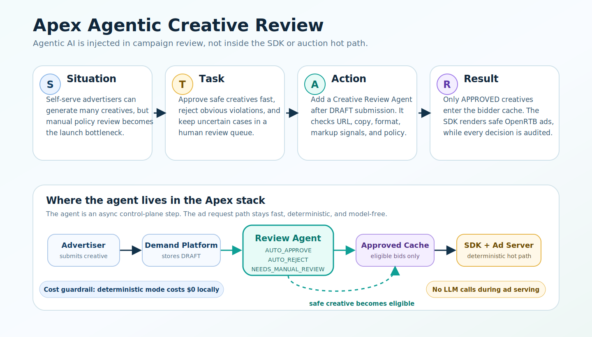
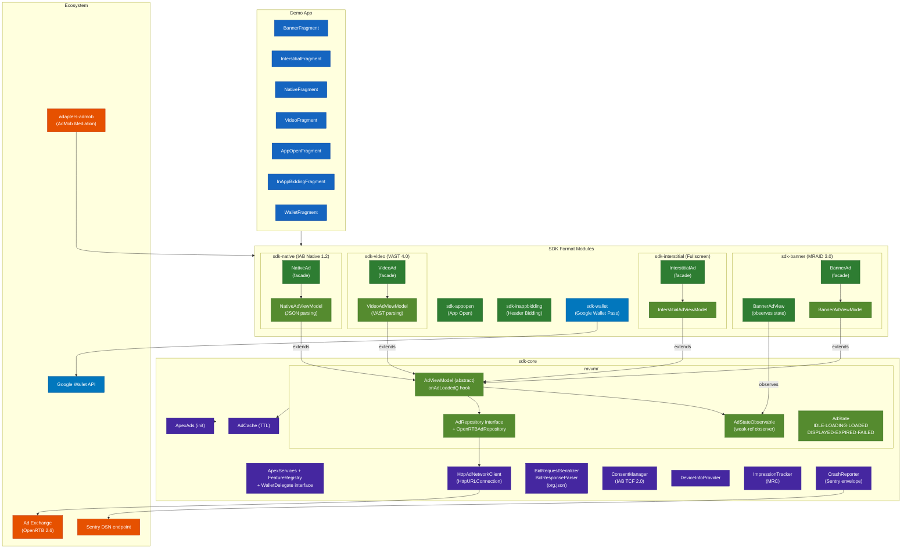
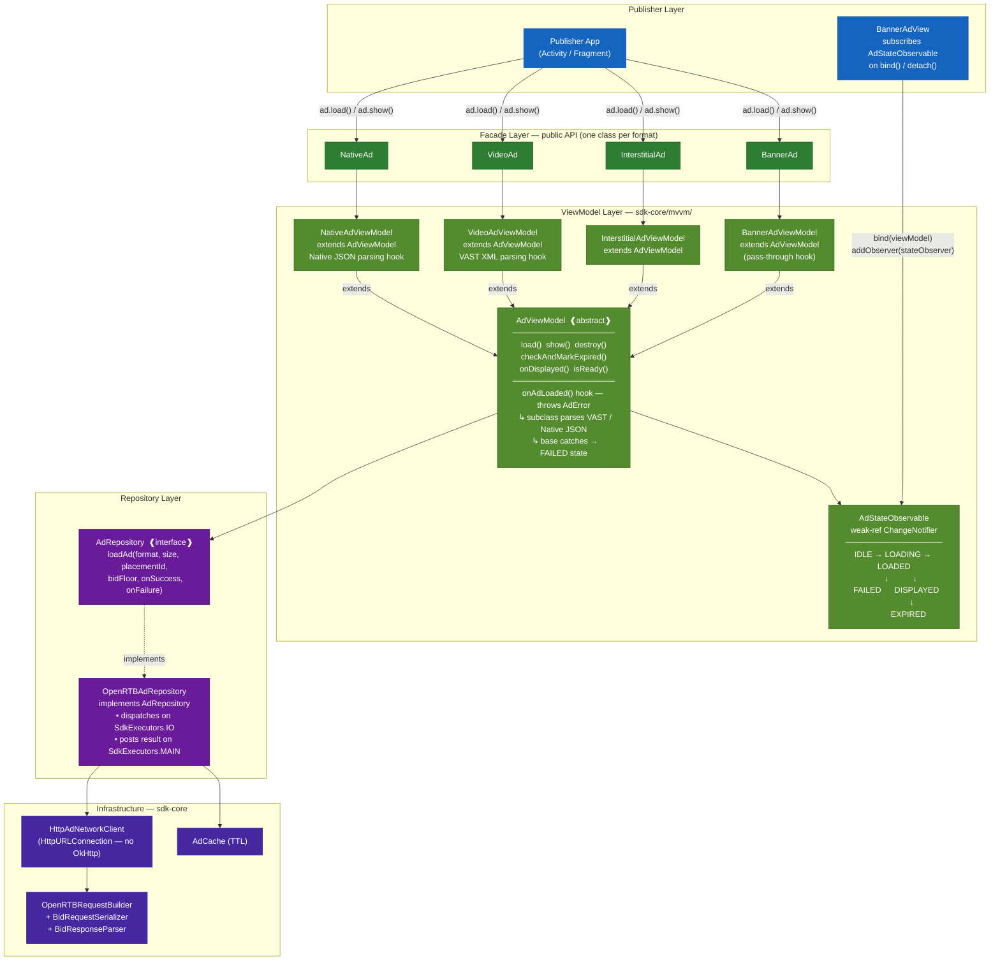
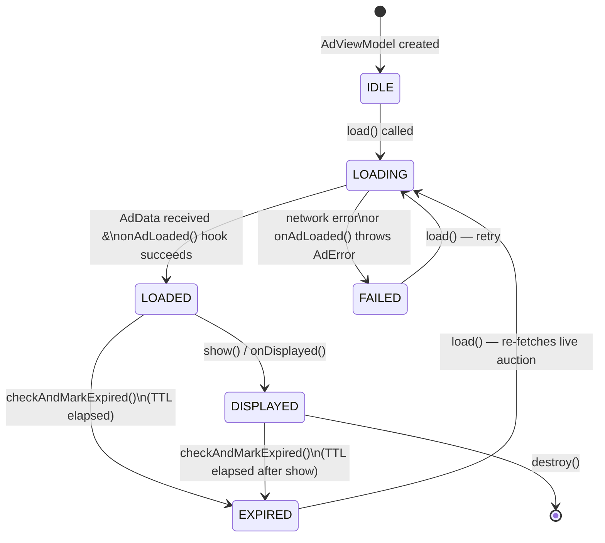
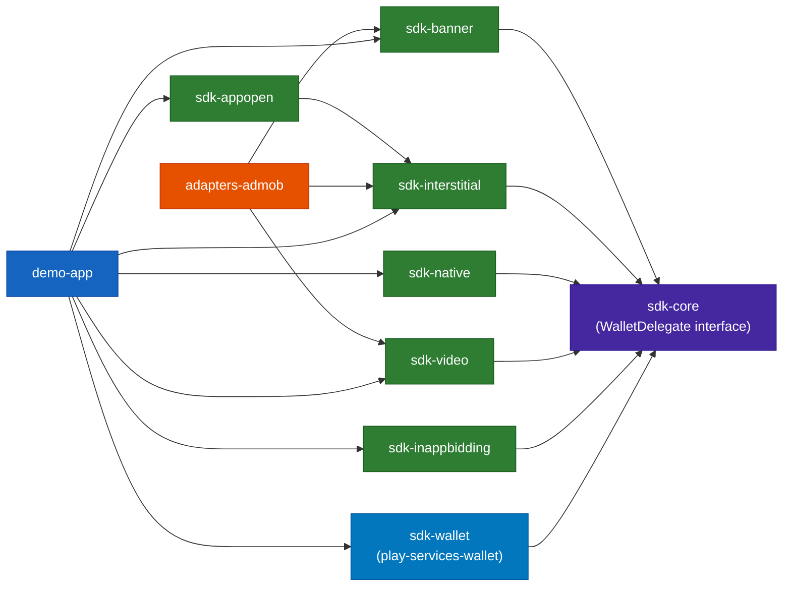
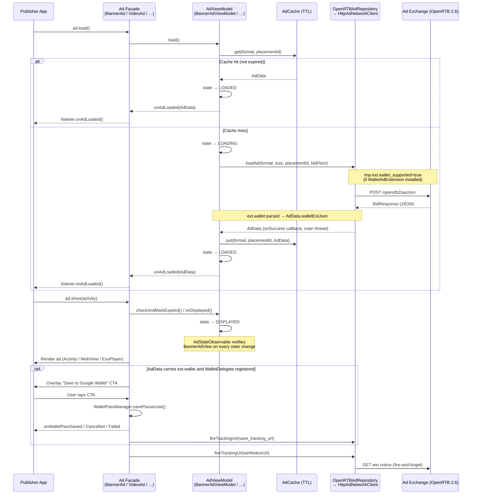
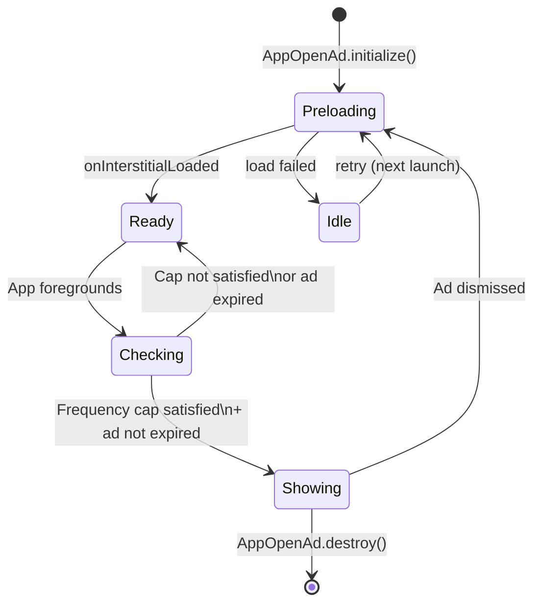

# ApexAd SDK — Android

> A production-grade programmatic advertising SDK demonstrating full-stack ad-tech engineering:
> OpenRTB 2.6 · VAST 4.0 · MRAID 3.0 · IAB Native 1.2 · IAB TCF 2.0 + GPP · App Open Ads · In-App Bidding · AdMob Mediation · Google Wallet Pass Ads · In-House Crash Reporting · Custom DI · MRC Viewability · Apex Trust Layer

[](https://android-arsenal.com/api?level=21)
[](https://www.iab.com/guidelines/openrtb/)
[](https://www.iab.com/guidelines/vast/)
[](https://www.iab.com/guidelines/mraid/)
[](#zero-third-party-runtime-dependencies)
[](LICENSE)

---

## Demo App

<table>
  <tr>
    <td align="center">
      <br/>
      <b>Banner + MRAID 3.0</b>
    </td>
    <td align="center">
      <br/>
      <b>Interstitial</b>
    </td>
    <td align="center">
      <br/>
      <b>IAB Native 1.2</b>
    </td>
  </tr>
  <tr>
    <td align="center">
      <br/>
      <b>App Open Ads</b>
    </td>
    <td align="center">
      <br/>
      <b>VAST 4.0 Rewarded Video</b>
    </td>
    <td align="center">
      <br/>
      <b>Google Wallet Pass Ad</b>
    </td>
  </tr>
</table>

## Portfolio Demo: Agentic Creative Review Loop

Apex is not only an Android SDK. The demo shows the full ad-tech loop from creative generation to safe serving, using an agentic review step in the demand platform.



| STAR | What happened |
|---|---|
| **Situation** | Self-serve advertisers can generate many creatives, but manual review becomes the launch bottleneck. |
| **Task** | Approve safe creatives fast, reject obvious violations, and keep uncertain cases in human review. |
| **Action** | Added a Creative Review Agent after draft submission in `apex-demand-platform`. It checks URL safety, copy, format, markup signals, and policy rules. |
| **Result** | Only `APPROVED` creatives enter the bidder cache. The SDK receives safe OpenRTB markup, and every agent decision is auditable. |

**What this demo proves**

| Capability | Implementation |
|---|---|
| Agentic AI where it belongs | Runs in `apex-demand-platform` after creative submission, not in the SDK or Go auction engine |
| Zero-cost local mode | `AI_REVIEW_MODE=deterministic` applies local guardrails without model calls |
| Optional model-backed review | `AI_REVIEW_MODE=openai` uses `gpt-5-nano` for non-obvious review cases |
| Approved-only serving | The DSP bidder cache only indexes `ACTIVE` campaigns with `APPROVED` creatives |
| Auditability | Every review writes outcome, confidence, rationale, and findings to `creative_review_runs` |
| Latency safety | `POST /api/dsp/bid` reads precomputed state and never calls an LLM |

**Emulated demo flow**

1. Run `apex-demand-platform` and open `http://localhost:3000/advertiser`.
2. Generate a wallet-save campaign.
3. Click `Submit all for review`.
4. The review agent classifies each creative as `APPROVED`, `REJECTED`, or still `PENDING_REVIEW`.
5. The approved creative becomes eligible for bidding through Apex Ad Server.
6. The SDK receives only approved OpenRTB markup and renders it using the existing banner, interstitial, native, video, or wallet modules.

## Apex Trust Layer

The SDK now emits privacy-aware device trust telemetry that the Apex Ad Server and
Apex Demand Platform can evaluate together. It is deliberately a layered fraud signal,
not a client-side claim that a device is guaranteed to be genuine.

| Control | SDK behavior |
|---|---|
| **Device risk telemetry** | Classifies common emulator and synthetic-device indicators as `LOW`, `MEDIUM`, or `HIGH` risk and sends `device_risk`, `emulator_suspected`, and a signal version in `device.ext.apex`. |
| **No SDK-only blocking** | The app still makes the request; server-side policy combines the signal with authentication, replay protection, supply-chain data, and event history before acting. |
| **Privacy propagation** | Reads both IAB TCF and GPP values from the platform consent store and serializes `regs.gpp` and `regs.gpp_sid` when present. |
| **Viewable native impressions** | Native impression trackers fire only after at least 50% of the registered view remains visible for one continuous second. |
| **Versioned signals** | `trust_signals_version` lets the server measure changes and roll out stronger attestations without silently changing the meaning of existing telemetry. |

This closes the easiest impression-farming path while avoiding the false promise that an
emulator heuristic can replace server-side validation or platform attestation. The next
hardening step is an optional Play Integrity-backed challenge for high-risk traffic.

## What Sets This SDK Apart

Most ad SDKs (including major ones from Google, Meta, Unity) share a common set of problems. ApexAds was designed to solve all of them out of the box:

| Feature | ApexAds | AdMob | MAX | IronSource / LevelPlay |
|---|:---:|:---:|:---:|:---:|
| **Google Wallet Pass Ads** | ✅ | ❌ | ❌ | ❌ |
| **First-Party Audience Cohorts** (zero-dep, privacy-gated) | ✅ | ❌ | ❌ | ❌ |
| App Open Ads (native SDK feature) | ✅ | ✅ | ❌ | ❌ |
| In-App / Header Bidding | ✅ | ❌ | ✅ (MAX) | ✅ (LevelPlay) |
| In-House Crash Reporting (no 3P SDK) | ✅ | ❌ | ❌ | ❌ |
| Custom Lightweight DI (no Hilt/Dagger) | ✅ | ❌ | ❌ | ❌ |
| Zero 3P Runtime Dependencies | ✅ | ❌ | ❌ | ❌ |
| AdMob Mediation Adapter | ✅ | — | ❌ | ❌ |
| MRC Viewability (frame-accurate) | ✅ | ✅ | ❌ | ❌ |
| MRAID 3.0 Rich Media | ✅ | ❌ | ❌ | ❌ |
| VAST 4.0 Rewarded Video | ✅ | ✅ | ✅ | ✅ |
| IAB TCF 2.0 Consent | ✅ | ✅ | ❌ | ❌ |
| IAB Native 1.2 | ✅ | ❌ | ❌ | ❌ |
| Optional feature modules (no transitive deps) | ✅ | ❌ | ❌ | ❌ |

### Differentiator Deep-Dives

#### 1. Google Wallet Pass Ads — Industry first

No other Android ad SDK supports Google Wallet pass delivery as an ad outcome. ApexAds embeds a native "Save to Google Wallet" CTA directly inside **existing** Interstitial and MRECT Banner formats — no separate ad format, no dedicated placement type, no DSP demand problem.

**The architecture insight:** A standalone `WalletAd` format would suffer near-zero fill rate because no DSP has demand for an opaque "wallet" placement. Instead, wallet is implemented as an optional *feature layer* on top of high-demand formats. Any interstitial or MRECT bid response can include an `ext.wallet` block; the SDK renders the CTA automatically when `sdk-wallet` is installed.

```kotlin
// Application.onCreate() — one line activates wallet CTAs across all eligible ads
ApexAds.init(this, config)
WalletAdExtension.install()  // registers WalletDelegate as an optional SDK feature

// Interstitial — wallet CTA panel appears automatically if ext.wallet is in the bid
val interstitial = InterstitialAd.Builder("placement-interstitial")
    .listener(object : InterstitialAdListener {
        override fun onInterstitialLoaded()              { interstitial.show(activity) }
        override fun onInterstitialFailed(e: AdError)    { /* handle */ }
        override fun onWalletPassSaved()                 { grantLoyaltyPoints() }
        override fun onWalletPassCancelled()             { /* user dismissed */ }
        override fun onWalletPassFailed()                { /* Google Wallet unavailable */ }
    }).build()
interstitial.load()

// MRECT Banner — wallet CTA strip appears automatically at bottom of banner
val banner = BannerAd.Builder("placement-mrect")
    .adSize(AdSize.MRECT_300x250)
    .listener(object : BannerAdListener {
        override fun onAdLoaded()                        { banner.show(bannerAdView) }
        override fun onAdFailed(e: AdError)              { /* handle */ }
        override fun onWalletPassSaved()                 { showSuccessMessage() }
    }).build()
banner.load()
```

**How it works end-to-end:**

```
Publisher App                  SDK Core                      SDK Wallet (optional)
─────────────                  ────────                      ─────────────────────
WalletAdExtension.install() ──→ FeatureRegistry.register
                                  (WalletDelegate feature)

InterstitialAd.load()       ──→ OpenRTBRequestBuilder
                                  detects WalletDelegate
                                  → imp.ext.wallet_supported=true
                               ──→ POST /openrtb2/auction
                               ←── BidResponse: ext.wallet { pass_jwt, cta_text, … }

InterstitialAd.show()       ──→ InterstitialActivity.onCreate
                                  adData.walletExtJson != null?
                                  → WalletDelegate.attachToInterstitial()
                                      builds bottom panel overlay
                                      "Save Coupon to Google Wallet" button

User taps CTA               ──→ WalletPassManager.savePassesJwt()
                               ←── Google Wallet result (onActivityResult)
                               ──→ WalletDelegate.handleActivityResult()
                               ──→ listener.onWalletPassSaved()
                               ──→ fire save_tracking_url (pixel)
```

**Zero dependency leakage:** `play-services-wallet` is scoped to `sdk-wallet` only. Publishers who don't call `WalletAdExtension.install()` never pull in Google Pay APIs and are unaffected.

#### 2. App Open Ads — Only the second SDK to offer this natively
Google AdMob introduced App Open as a dedicated ad format in 2021. No other Android ad SDK has followed. ApexAds implements the full lifecycle — background detection, frequency capping, automatic preload and re-preload after dismiss — backed by the same OpenRTB pipeline as every other format.

```kotlin
// Application.onCreate()
AppOpenAd.initialize(this, "placement-appopen", object : AppOpenAd.Listener {
    override fun onAppOpenAdLoaded()                    { /* ad is warm */ }
    override fun onAppOpenAdDismissed()                 { /* user dismissed */ }
    override fun onAppOpenAdFailedToLoad(error: AdError){ /* handle */ }
})
AppOpenAd.setFrequencyCapHours(1)   // show at most once per hour
AppOpenAd.setAdExpiryMinutes(30)    // discard stale cached ad after 30 min
```

#### 3. In-House Crash Reporting — Zero Sentry SDK dependency
Crash events are serialized to the Sentry envelope protocol and delivered via raw `HttpURLConnection` — no Sentry Android SDK on the classpath. The reporter installs a `Thread.UncaughtExceptionHandler`, retries delivery up to 3× with exponential back-off, and respects 429 rate limits.

```kotlin
ApexAdsConfig.Builder("APP_TOKEN")
    .sentryDsn("https://key@o123.ingest.sentry.io/project")
    .build()
// ↑ crash reporting is fully automatic after this. No other wiring needed.
```

#### 4. Custom DI — No Hilt, No Dagger, No Koin
Annotation processors from DI frameworks conflict with host app DI graphs and slow incremental builds. Apex uses a tiny in-house container instead: `ApexServices` owns typed core services, while library-internal feature access is limited to optional `SdkFeature` contracts backed by a `ConcurrentHashMap<Class, SdkFeature>`. There is zero reflection at runtime and zero transitive DI dependency.

```kotlin
// Core services are typed and created once at init time:
ApexAds.init(this, config)
// Optional feature modules register only feature contracts through SDK internals:
WalletAdExtension.install() // → ServiceLocator.register(WalletDelegate::class.java, …)
```

#### 5. Zero 3P Runtime Dependencies
Every SDK imported into a publisher app risks version conflicts with the publisher's own dependencies. ApexAds runtime uses only Android platform APIs:

| Replaced | With |
|---|---|
| OkHttp | `java.net.HttpURLConnection` |
| Gson | `org.json.JSONObject` (built into Android) |
| Timber | Custom `AdLog` over `android.util.Log` |
| Sentry SDK | Raw HTTP envelope protocol over `HttpURLConnection` |
| Hilt / Dagger | Typed `ApexServices` + feature-only `ServiceLocator` |

Optional feature modules (`sdk-wallet`) bring their own scoped dependencies without leaking them into `sdk-core` or the publisher's compile classpath.

---

## Architecture Overview



---

## SDK MVVM Architecture

The SDK is layered into four concerns separated by stable interfaces — the same pattern as Smaato's ng-sdk-android, adapted for a third-party SDK that cannot rely on `androidx.lifecycle.ViewModel` or `ViewModelStoreOwner`.



### State machine

`AdStateObservable` is the single source of truth for ad lifecycle state. Every state transition is published to all registered observers (e.g. `BannerAdView` clears its `WebView` when `EXPIRED` is received).



### Key design decisions

| Decision | Rationale |
|---|---|
| Custom `AdViewModel` (not AndroidX) | Third-party SDKs have no `ViewModelStoreOwner`. Mirrors Smaato ng-sdk-android's `SmaatoSdkViewModel` pattern. |
| `onAdLoaded() throws AdError` | Lets VAST/Native subclasses signal parse failure without re-entrant callback chains. Base class `applyLoaded()` catches and transitions to `FAILED`. |
| `AdStateObservable` weak references | Views are held by the publisher's layout. Weak refs prevent the ViewModel from leaking the Activity/Fragment via observer registration. |
| `AdRepository` interface | Decouples `AdViewModel` from HTTP; `OpenRTBAdRepository` is the production impl, swappable with `MockAdRepository` in tests. |
| Thin facades | `BannerAd`, `InterstitialAd`, etc. own a ViewModel and bridge format-specific listeners to the generic `AdViewModelListener` contract. Zero business logic lives in facades. |

---

## Module Dependency Graph



| Module | Depends On | Responsibility |
|---|---|---|
| `sdk-core` | — (Android platform only) | SDK init, OpenRTB models, HTTP networking, ad cache, consent, DI, crash reporting, logging, `WalletDelegate` interface; **MVVM base layer** — `AdViewModel`, `AdStateObservable`, `AdRepository`, `AdState` |
| `sdk-banner` | `sdk-core` | `BannerAd` facade + `BannerAdViewModel` (extends `AdViewModel`); `BannerAdView` (observes `AdStateObservable`); MRAID 3.0 WebView; auto-attaches wallet CTA on MRECT |
| `sdk-interstitial` | `sdk-core` | `InterstitialAd` facade + `InterstitialAdViewModel`; fullscreen HTML activity; auto-attaches wallet bottom panel |
| `sdk-native` | `sdk-core` | `NativeAd` facade + `NativeAdViewModel` (IAB Native 1.2 JSON parsing hook); publisher-controlled view binding |
| `sdk-video` | `sdk-core` | `VideoAd` facade + `VideoAdViewModel` (VAST 4.0 XML parsing hook); ExoPlayer rewarded video; quartile tracking |
| `sdk-appopen` | `sdk-interstitial` | App Open Ads — foreground detection, frequency cap, auto-preload; delegates lifecycle to `InterstitialAdViewModel` |
| `sdk-inappbidding` | `sdk-core` | Header bidding price signals via `ApexInAppBidder`; MAX/LevelPlay mock simulation |
| `sdk-wallet` | `sdk-core` | Google Wallet pass delivery; `play-services-wallet` scoped here only — zero leakage |
| `adapters-admob` | `sdk-banner`, `sdk-interstitial`, `sdk-video` | AdMob mediation adapter (Banner, Interstitial, Rewarded) |
| `demo-app` | all modules | MVVM showcase app, MockAdExchange integration |

---

## Ad Request Lifecycle



---

## App Open Ad Lifecycle



---

## Ad Tech Standards Implemented

### OpenRTB 2.6 (IAB)
Full bid request/response object graph — `BidRequest`, `Impression`, `Banner`, `Video`, `Native`, `App`, `Device`, `User`, `Regs`, `Geo`, and all extension objects. Serialized to JSON with hand-written `org.json` serializer (no Gson/Moshi). Supports `imp.ext` for capability signalling (e.g. `wallet_supported: true`).

```kotlin
val request = OpenRTBRequestBuilder(deviceInfoProvider, consentManager)
    .adFormat(AdFormat.BANNER)
    .adSize(AdSize.MRECT_300x250)
    .placementId("placement-mrect")
    .bidFloor(0.50)
    .build()
// → POSTs JSON to ad exchange endpoint, parses BidResponse
// → automatically includes imp.ext.wallet_supported=true when sdk-wallet is installed
```

### MRAID 3.0 (IAB)
Full JavaScript bridge injected into ad WebViews. Implements `mraid.close()`, `mraid.expand()`, `mraid.resize()`, `mraid.open()`, `mraid.getState()`, `mraid.isViewable()`, `mraid.supports()`, and all lifecycle events.

### VAST 4.0 (IAB)
Pure-Java XML parser handles Inline and Wrapper VAST. Quartile tracking events (start, 25%, 50%, 75%, complete) fire automatically via ExoPlayer position polling every 500ms.

### IAB TCF 2.0 / GDPR
Reads `IABTCF_TCString`, `IABTCF_gdprApplies`, and `IABUSPrivacy_String` from SharedPreferences — the standardised keys written by any compliant CMP. Consent signals are auto-wired into `Regs` and `User` OpenRTB objects.

### MRC Viewability Standard
`ImpressionTracker` attaches a `ViewTreeObserver.OnPreDrawListener` to measure visible pixel ratio every frame. Impression fires only when ≥50% of pixels are in-view for ≥1 continuous second. Properly cleans up the listener on view detach (memory-safe).

### In-App Bidding / Header Bidding
`ApexInAppBidder` fetches a real-time bid from the exchange and packages it as a `BidToken` price signal — compatible with MAX and LevelPlay's `setLocalExtraParameter` / `setSignal` patterns.

### Google Wallet Pass Ads (ext.wallet)
Non-standard OpenRTB extension (`ext.wallet`) carries a signed Google Wallet pass JWT alongside the creative. The SDK parses this, presents a native "Save to Google Wallet" CTA, and invokes `PayClient.savePassesJwt()` — with result handling, tracking pixel, and publisher callbacks.

---

## First-Party Audience Targeting (Cohorts)

Programmatic SDKs send mostly **contextual + device** signals, so advertisers have little first-party audience to bid on — which caps eCPM and forces generic targeting. The usual fixes make it worse: bundling on-device ML or scripting runtimes **bloats app size**, trips **Google's 16 KB page-size policy** at Play Store upload (native `.so` libraries), and drags in engines that **conflict with publisher Gradle/AGP versions**. And any audience data is a regulatory liability if it moves without consent.

ApexAds adds an audience layer that avoids every one of those traps:

- **Declarative, not executable.** Cohort definitions are **JSON rule data** interpreted by a tiny in-SDK matcher (`all`/`any`/`not` + `eq`/`in`/`prefix`/`gt`…). There is **no embedded JavaScript/scripting engine**, so nothing can conflict with a publisher's build.
- **Zero added weight.** Pure JVM — **no ML runtime, no native libraries, no new dependencies.** No app-size bloat, no 16 KB page-size warnings, and the SDK's *zero runtime dependencies* guarantee is preserved.
- **No new data collection.** Cohorts are evaluated against signals the SDK **already** gathers for the bid request (language, connection type, device type, locale, bundle). No sensors, no location polling, no new permissions.
- **Standards-native carrier.** Matched cohorts ride as **OpenRTB 2.6 `user.data[].segment[]`** — every DSP already understands them; no proprietary plumbing.
- **Privacy-gated by default.** Cohorts attach **only** when the user has granted IAB **TCF Purpose 4** (and has not signalled a US Privacy opt-out). Consent is read from the CMP-decoded `IABTCF_PurposeConsents` flag — no TC-string parsing on-device. With no consent the request is purely contextual; with no rules configured the feature is fully off (zero cost).

**Advantages:** higher eCPM through audience-based bidding, cohort rules that are **remotely reconfigurable without an app update**, and heavy audience modelling kept server-side where it belongs.

Remote cohort rules are pushed through SDK-internal runtime plumbing, not the
publisher-facing `ApexAds` API. Publisher apps initialize the SDK once; Apex
keeps audience rule delivery owned by the SDK/server pipeline.

---

## Project Structure

```
apex-ad-sdk-android/
│
├── sdk-core/                          # Zero 3P runtime deps — Android platform APIs only
│   └── com/apexads/sdk/
│       ├── ApexAds.java               # SDK singleton entry point
│       ├── ApexAdsConfig.java         # Immutable builder-pattern configuration
│       ├── internal/
│       │   ├── ApexSdkRuntime         # Library-internal runtime/service access
│       │   ├── ApexServices           # Internal typed SDK component root
│       │   └── ApexFeatureAccess      # Internal optional feature access
│       └── core/
│           ├── mvvm/                  # ◀ MVVM base layer (custom — no AndroidX dependency)
│           │   ├── AdState            # 6-phase enum: IDLE·LOADING·LOADED·DISPLAYED·EXPIRED·FAILED
│           │   ├── AdStateObserver    # Callback interface for state transitions
│           │   ├── AdStateObservable  # Weak-ref ChangeNotifier; delivers current state on subscribe
│           │   ├── AdViewModelListener# Internal view contract: onAdLoaded / onAdFailed / onAdExpired
│           │   ├── AdRepository       # Interface: loadAd(format, size, placementId, bidFloor, …)
│           │   ├── OpenRTBAdRepository# Impl: IO-thread dispatch, main-thread callbacks
│           │   └── AdViewModel        # Abstract base ViewModel (not AndroidX); load/show/destroy lifecycle
│           ├── di/
│           │   ├── FeatureRegistry    # ConcurrentHashMap-backed optional feature registry
│           │   ├── ServiceLocator     # Feature-only facade for optional modules
│           │   ├── SdkFeature         # Marker for installable feature contracts
│           │   └── WalletDelegate     # Feature interface — decouples sdk-core from sdk-wallet
│           ├── network/
│           │   ├── AdNetworkClient    # Interface (2 methods)
│           │   ├── HttpAdNetworkClient# HttpURLConnection impl (no OkHttp)
│           │   ├── SdkHttpClient      # Raw HTTP helper
│           │   ├── BidRequestSerializer  # org.json serializer (no Gson)
│           │   └── BidResponseParser     # org.json parser + ext.wallet extraction
│           ├── models/openrtb/        # Full OpenRTB 2.6 POJO graph
│           ├── request/OpenRTBRequestBuilder  # Auto-signals wallet_supported
│           ├── cache/AdCache          # Thread-safe TTL-based ad cache
│           ├── consent/ConsentManager # IAB TCF 2.0 SharedPreferences reader
│           ├── device/DeviceInfoProvider
│           ├── tracking/ImpressionTracker  # MRC viewability (frame-accurate)
│           ├── crashreporter/         # In-house Sentry envelope reporter
│           │   ├── SentryDsn          # DSN parser → envelope URL
│           │   ├── CrashEvent         # Sentry envelope serializer (no Sentry SDK)
│           │   ├── CrashDelivery      # HTTP POST, 3× retry, 429-aware
│           │   └── CrashReporter      # UncaughtExceptionHandler installer
│           ├── error/AdError          # Typed error sealed hierarchy
│           └── utils/AdLog            # android.util.Log wrapper (no Timber)
│
├── sdk-banner/                        # Banner + MRAID 3.0
│   └── BannerAd               # Thin facade; owns BannerAdViewModel; auto-attaches wallet CTA on MRECT
│   └── BannerAdViewModel      # extends AdViewModel; pass-through onAdLoaded() hook
│   └── BannerAdView           # Subscribes AdStateObservable; clears WebView on EXPIRED
│   └── mraid/MRAIDBridge
│
├── sdk-interstitial/                  # Fullscreen interstitial
│   └── InterstitialAd         # Thin facade; owns InterstitialAdViewModel; auto-attaches wallet panel
│   └── InterstitialAdViewModel# extends AdViewModel; launches InterstitialActivity on show()
│   └── InterstitialActivity
│
├── sdk-native/                        # IAB Native 1.2
│   └── NativeAd               # Thin facade; owns NativeAdViewModel
│   └── NativeAdViewModel      # extends AdViewModel; onAdLoaded() parses IAB Native 1.2 JSON
│   └── NativeAdParser (org.json) / NativeAdView
│
├── sdk-video/                         # VAST 4.0 rewarded video
│   └── VideoAd                # Thin facade; owns VideoAdViewModel
│   └── VideoAdViewModel       # extends AdViewModel; onAdLoaded() parses VAST 4.0 XML
│   └── VideoAdActivity / vast/VastParser
│
├── sdk-appopen/                       # App Open Ads  ◀ unique to ApexAds + AdMob
│   └── AppOpenAd              # Public static facade
│   └── AppOpenAdManager       # Singleton lifecycle manager
│   └── AppOpenAdFrequencyCap  # SharedPreferences frequency cap
│
├── sdk-wallet/                        # Google Wallet Pass Ads  ◀ unique to ApexAds
│   └── WalletAdExtension      # install() — one call enables wallet across all formats
│   └── WalletDelegateImpl     # Implements WalletDelegate; builds CTA panels
│   └── WalletResultActivity   # Transparent Activity for banner wallet flow
│   └── WalletPassData         # Parsed ext.wallet value object
│   └── WalletPassManager      # Thin PayClient wrapper (stateless)
│
├── sdk-inappbidding/                  # Header bidding / in-app bidding
│   └── ApexInAppBidder / BidToken / InAppBidListener
│   └── mock/MockMediationPlatform     # Simulates MAX/LevelPlay waterfall
│
├── adapters-admob/                    # AdMob mediation adapters
│   └── ApexAdsAdMobAdapter    # Main entry point (extends Adapter)
│   └── ApexAdsBannerAdapter / ApexAdsInterstitialAdapter / ApexAdsRewardedAdapter
│
└── demo-app/                          # MVVM showcase (no live server needed)
    └── DemoApplication        # SDK init + MockAdExchange + AppOpenAd + WalletAdExtension
    └── ui/banner / interstitial / native / video / appopen / inappbidding / wallet
```

---

## Integration Guide

### 1. Initialize the SDK

```kotlin
// Application.onCreate()
ApexAds.init(this, ApexAdsConfig.Builder("YOUR_APP_TOKEN")
    .adServerUrl("https://your-openrtb-endpoint.com/auction")
    .cacheTtlSeconds(300)
    .gdprConsentString(tcfString)
    .sentryDsn("https://key@o123.ingest.sentry.io/project") // optional crash reporting
    .build())
```

There is no publisher-facing global cleanup API. Ad objects and views own their lifecycle through their existing `destroy()` and view cleanup methods; test and demo re-initialization uses restricted SDK-internal runtime hooks.

### 2. Google Wallet Pass Ads

Add the `sdk-wallet` module to activate wallet CTAs inside Interstitial and MRECT Banner ads:

```kotlin
// Application.onCreate() — after ApexAds.init()
WalletAdExtension.install()
// That's it. No changes to existing InterstitialAd or BannerAd code required.
// The SDK signals wallet_supported=true to the exchange and renders the CTA automatically.
```

```kotlin
// Existing interstitial — wallet CTA panel appears automatically when ext.wallet is present
val interstitial = InterstitialAd.Builder("placement-interstitial")
    .listener(object : InterstitialAdListener {
        override fun onInterstitialLoaded()            { interstitial.show(activity) }
        override fun onInterstitialFailed(e: AdError)  { /* handle */ }
        // New wallet callbacks — default no-op if not overridden
        override fun onWalletPassSaved()               { grantLoyaltyPoints() }
        override fun onWalletPassCancelled()           { /* user dismissed */ }
        override fun onWalletPassFailed()              { /* Google Wallet unavailable */ }
    }).build()
interstitial.load()

// Existing MRECT banner — wallet CTA strip appears automatically when ext.wallet is present
val banner = BannerAd.Builder("placement-mrect")
    .adSize(AdSize.MRECT_300x250)
    .listener(object : BannerAdListener {
        override fun onAdLoaded()                      { banner.show(bannerAdView) }
        override fun onAdFailed(e: AdError)            { /* handle */ }
        override fun onWalletPassSaved()               { showSuccessMessage() }
    }).build()
banner.load()
```

> **Note:** `play-services-wallet` is a dependency of `sdk-wallet` only. Publishers who omit `sdk-wallet` from their Gradle build — or who never call `WalletAdExtension.install()` — are completely unaffected. Ads load and display normally; the wallet CTA is simply absent.

### 3. App Open Ads

```kotlin
// Application.onCreate() — fires automatically on every background→foreground
AppOpenAd.initialize(this, "placement-appopen", listener)
AppOpenAd.setFrequencyCapHours(1)
AppOpenAd.setAdExpiryMinutes(30)
```

### 4. Banner

```xml
<com.apexads.sdk.banner.BannerAdView
    android:id="@+id/banner_ad_view"
    android:layout_width="320dp"
    android:layout_height="50dp" />
```

```kotlin
val banner = BannerAd.Builder("placement-banner")
    .adSize(AdSize.BANNER_320x50)
    .listener(object : BannerAdListener {
        override fun onAdLoaded() = banner.show(bannerAdView)
        override fun onAdFailed(error: AdError) = handleError(error)
    }).build()
banner.load()
```

### 5. Interstitial

```kotlin
val interstitial = InterstitialAd.Builder("placement-interstitial")
    .listener(object : InterstitialAdListener {
        override fun onInterstitialLoaded() { /* show at natural pause */ }
        override fun onInterstitialFailed(error: AdError) = handleError(error)
    }).build()
interstitial.load()
// at a content transition:
if (interstitial.isReady()) interstitial.show(activity)
```

### 6. Rewarded Video

```kotlin
val video = VideoAd.Builder("placement-video")
    .listener(object : VideoAdListener {
        override fun onVideoAdLoaded()  { showButton.isEnabled = true }
        override fun onRewardEarned()   { grantReward() }
        override fun onVideoAdFailed(error: AdError) = handleError(error)
    }).build()
video.load()
```

### 7. Native

```kotlin
val native = NativeAd.Builder("placement-native")
    .listener(object : NativeAdListener {
        override fun onNativeAdLoaded(ad: NativeAd) = ad.bindTo(nativeAdView)
        override fun onNativeAdFailed(error: AdError) = handleError(error)
    }).build()
native.load()
```

### 8. In-App Bidding (Header Bidding)

```kotlin
// Call before loading your mediation ad:
ApexInAppBidder.fetchBidToken("placement-001", AdFormat.INTERSTITIAL, object : InAppBidListener {
    override fun onBidReady(token: BidToken) {
        // Pass price signal to MAX / LevelPlay:
        maxAd.setLocalExtraParameter("apex_bid_token", token.token)
        maxAd.setLocalExtraParameter("apex_bid_cpm", token.cpmUsd.toString())
        maxAd.loadAd()
    }
    override fun onBidFailed(error: AdError) = maxAd.loadAd() // waterfall fallback
})
```

### 9. AdMob Mediation

Configure in the AdMob dashboard:
- **Class name:** `com.apexads.sdk.adapters.admob.ApexAdsAdMobAdapter`
- **Server parameters:** `{"placementId":"your-id","appToken":"your-token"}`

No additional code needed — AdMob calls the adapter automatically.

---

## Demo App

The demo app uses `MockAdExchange` — an in-process OpenRTB mock that returns realistic bid responses. No backend setup, API key, or network required.

| Tab | Format | Demonstrates |
|---|---|---|
| Banner | 320×50 HTML + MRAID | OpenRTB auction → MRAID 3.0 WebView → MRC viewability |
| Interstitial | Fullscreen HTML | Pre-load / show lifecycle, MRAID close, separate Activity |
| Native | IAB Native 1.2 | OpenRTB native request, org.json asset parsing, publisher layout |
| Video | VAST 4.0 Rewarded | VAST parsing, ExoPlayer, quartile tracking, skip button, reward |
| App Open | Fullscreen Interstitial | Background→foreground detection, frequency cap, auto-preload |
| In-App Bidding | Price signal | Header bidding token → mock MAX/LevelPlay waterfall auction |
| **Wallet** | **Interstitial + MRECT** | **Google Wallet CTA in existing formats; ext.wallet from MockAdExchange** |

```bash
git clone https://github.com/Madroid2/apex-ad-sdk-android.git
cd apex-ad-sdk-android
./gradlew :demo-app:installDebug
```

---

## Standards & References

| Standard | Version | Reference |
|---|---|---|
| OpenRTB | 2.6 | [IAB OpenRTB 2.6](https://www.iab.com/wp-content/uploads/2022/04/OpenRTB-2-6_FINAL.pdf) |
| VAST | 4.0 | [IAB VAST 4.0](https://www.iab.com/guidelines/vast/) |
| MRAID | 3.0 | [IAB MRAID 3.0](https://www.iab.com/guidelines/mraid/) |
| OpenRTB Native | 1.2 | [IAB Native Ads API](https://www.iab.com/guidelines/openrtb-native-ads-api-specification-version-1-2/) |
| TCF | 2.0 | [IAB TCF 2.0](https://github.com/InteractiveAdvertisingBureau/GDPR-Transparency-and-Consent-Framework) |
| MRC Viewability | — | [MRC Display Measurement Guidelines](https://www.mediaratingcouncil.org) |
| Sentry Envelope | — | [Sentry Envelope Protocol](https://develop.sentry.dev/sdk/data-model/envelopes/) |
| Google Wallet | — | [Google Wallet Passes API](https://developers.google.com/wallet/generic/android) |
