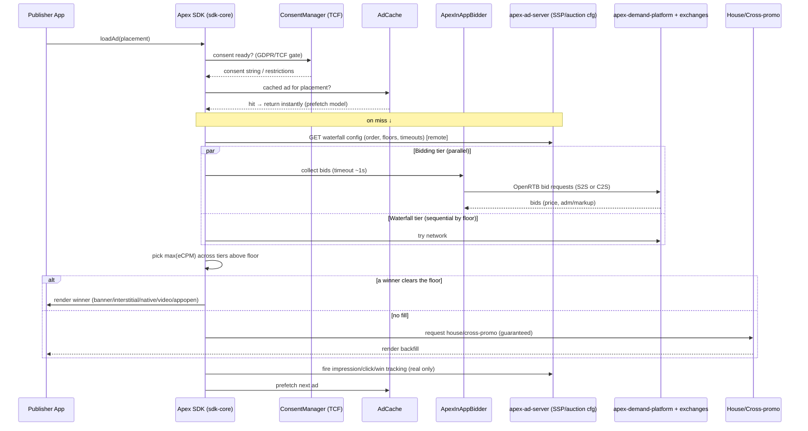

# Apex SDK — Mediation‑First Demand Architecture

*How the Apex SDK orchestrates real demand (your OpenRTB exchange + AdMob + bidding networks) and guarantees fill from day one — grounded in the modules you already have (`sdk-core`, `sdk-inappbidding`, `adapters-admob`, `apex-ad-server`, `apex-demand-platform`).*

---

## 0. Read this first — the one correction that changes the design

You proposed: **Apex → AdMob → (no fill) → MAX → (no fill) → ironSource.**

The instinct (a fallback chain to push up fill rate) is right. The specific rungs are not, for two reasons:

1. **AdMob, AppLovin MAX, and ironSource (LevelPlay) are *mediators*, not demand sources.** Each one wants to BE the mediation layer and run its own waterfall/bidding underneath. You generally **cannot legitimately stack two rival mediators** beneath your own mediator — their SDK terms typically forbid being mediated by a competing mediator, and Google in particular restricts third‑party mediation of Google demand. Chaining them would also mean three competing auction engines fighting each other.
2. **Your `adapters-admob` module already implements the *opposite* topology.** It implements Google's `MediationBannerAdConfiguration` / custom‑event API — i.e., **AdMob is the mediator and Apex is a demand source plugged into it.** That's topology A below, and it's actually a great low‑friction adoption path — just not "Apex orchestrates AdMob."

So there are two valid topologies. Support both; lead with B for the partner scenario.

| | **Topology A — Apex as a demand source** (you have this) | **Topology B — Apex as the mediator** (what you asked for) |
|---|---|---|
| Who runs the auction | AdMob (or MAX) | **Apex SDK** |
| Apex's role | One network inside the publisher's existing AdMob waterfall/bidding | The orchestrator calling AdMob + your exchange + bidding networks + house ads |
| Adoption friction | **Low** — publisher already on AdMob just adds the Apex adapter | Higher — publisher makes Apex their mediation SDK |
| Who owns data/relationship | AdMob | **Apex** (needed for your build‑in‑public data story) |
| Best for | Fast first integrations, extra demand | Partners who let you own the stack |

**Recommendation:** ship both. Use **A** to get easy early integrations (and real data *flowing through* AdMob), and build **B** as the flagship for design partners who want Apex to own monetization. The rest of this doc designs **B**.

---

## 1. Demand sources you *can* legitimately chain (the corrected fallback set)

Replace "AdMob → MAX → ironSource" with real demand sources that allow SDK‑level mediation/bidding integration, ordered by how you'd actually call them:

1. **Apex exchange / your own demand** — `apex-demand-platform` over OpenRTB 2.6 (you already model `BidRequest`/`BidResponse`). This is your highest‑margin demand and the data you most want to showcase.
2. **Bidding networks** (parallel, real‑time) — networks that publish bidding adapters: e.g., **Meta Audience Network, Mintegral, Unity Ads, Liftoff/Vungle, InMobi, Pangle**. *(Availability/terms vary by network — verify each before integrating.)*
3. **AdMob — only via a supported path.** Either keep topology A (Apex inside AdMob), or, if Apex must be the mediator, integrate **Google demand through Google Ad Manager / the supported Google bidding integration**, not by treating AdMob as a generic rung. Treat "AdMob as a waterfall rung under Apex" as **not supported** until you confirm Google's current terms.
4. **House ads / cross‑promo** — your guaranteed backfill tier (see §4). This is what makes fill ≈ 100%.

> ⚠️ Honesty tie‑in (from our earlier discussion): your current `FallbackAdNetworkClient` falls back to `MockAdExchange` on no‑fill. **In production the last rung must be real house/cross‑promo ads, never mock demand presented as real.** Keep `MockAdExchange` strictly behind a debug flag for local testing.

---

## 2. Recommended decisioning model: **hybrid bidding + waterfall** (not pure waterfall)

A pure sequential waterfall (your proposed model) is simple but has two well‑known problems: **latency stacks up** (each no‑fill rung adds a round‑trip) and it **leaves money on the table** (fixed order can't react to a high real‑time bid). Modern mediation is a hybrid:

- **In‑app bidding tier (parallel):** fire one simultaneous bid request to all bidding‑enabled sources at once (you already have `sdk-inappbidding/ApexInAppBidder` + `BidToken`). Collect bids within a global timeout. Highest bid wins this tier.
- **Waterfall tier (sequential):** for networks that don't support bidding, keep a **price‑ordered** waterfall (server‑configured floors), tried in order until one fills.
- **Compare & decide:** winning bid vs. the first waterfall fill above its floor → pick higher eCPM.
- **Backfill:** if nothing clears the floor, serve **house/cross‑promo** so the slot is never blank.

This is the architecture that gives a partner *real fill from day one* (house backfill guarantees it) while continuously improving eCPM as real demand ramps.

---

## 3. Request flow (the "sketch")



ASCII fallback view of the decision ladder:

```
loadAd()
  └─ consent gate (TCF) ──▶ cache hit? ──▶ serve instantly
        └─ miss ▶ fetch remote waterfall config
              ├─ [PARALLEL] bidding tier: Apex exchange + Meta/Mintegral/Unity/… → best bid
              ├─ [SEQUENTIAL] waterfall tier: network A → B → C (by floor) → first fill
              ├─ pick highest eCPM above floor
              └─ none? ▶ HOUSE / CROSS‑PROMO backfill  (never blank, never mock)
```

---

## 4. The "fill rate" tiers (your real goal, done right)

| Tier | Source | Purpose | Fill | eCPM |
|---|---|---|---|---|
| 1 | Apex exchange + bidding networks (parallel) | Maximize yield | Variable | Highest |
| 2 | Waterfall networks (by floor) | Catch demand bidding missed | Medium | Medium |
| 3 | **House ads / cross‑promo** | **Guarantee a fill, recruit devs** | **~100%** | Low (or $0, but a real ad) |

Fill rate is "solved" by tier 3: the slot is **always** filled by a real house/cross‑promo creative when paid demand doesn't clear. That's how a brand‑new network shows a partner non‑zero fill on day one — honestly.

---

## 5. Unified adapter SPI (so networks plug in uniformly)

Today you have format‑specific static adapters (`ApexAdsBannerAdapter.load(...)`, etc.) aimed at the AdMob custom‑event API. For topology B you want **one mediation adapter contract** every demand source implements, so the orchestrator treats them uniformly:

```java
public interface ApexMediationAdapter {
    String network();                 // "apex_exchange", "meta", "mintegral", "house"...
    boolean supportsBidding();        // true → joins the parallel tier
    void initialize(Context ctx, AdapterConfig cfg, InitCallback cb);

    // Bidding tier
    void collectBid(BidContext ctx, BidCallback cb);   // returns price + token/markup

    // Waterfall tier
    void loadAd(AdRequest req, double floorCpm, AdLoadCallback cb);

    // Common
    void show(Context ctx, ShowCallback cb);           // for full-screen formats
    AdFormat[] supportedFormats();
}
```

- The existing `adapters-admob` stays as the **topology‑A** entry point (Apex‑inside‑AdMob).
- New adapters (`adapters-meta`, `adapters-mintegral`, `adapters-house`, …) implement `ApexMediationAdapter` for **topology B**.
- A new `sdk-core/mediation/` package holds the orchestrator: `MediationController` (runs tiers), `WaterfallConfig` (from server), `AuctionResult`.

---

## 6. Server‑driven control (`apex-ad-server` + `apex-demand-platform`)

Put **all decisioning policy on the server** so you tune without app releases:

- **`apex-ad-server` = SSP + mediation config service.** Endpoints:
  - `GET /v1/waterfall?placement=…` → ordered adapter list, floors, per‑adapter + global timeouts, tier membership. (Cache client‑side with short TTL.)
  - `POST /v1/auction` *(optional S2S)* → server runs the OpenRTB auction against `apex-demand-platform` + connected exchanges and returns the winning `BidResponse`. S2S keeps keys/logic off‑device and centralizes yield logic.
  - `POST /v1/events` → impressions/clicks/wins/no‑fill/latency (feeds your analytics + the build‑in‑public numbers).
- **`apex-demand-platform` = your DSP/demand + cross‑promo engine.** Holds campaigns, cross‑promo line items, and house creatives; answers bid requests.
- **Why server‑driven:** you can reorder the waterfall, change floors, add a network, or flip on the guaranteed‑floor subsidy for a specific partner — all remotely.

---

## 7. Latency, caching, reliability

- **Parallel bidding with a hard global timeout** (~1000–1500 ms); per‑adapter timeouts so one slow SDK can't stall the auction.
- **Prefetch via `AdCache`** (you have it): load the *next* ad after each impression so the next `loadAd()` is an instant cache hit — this hides almost all mediation latency for the user.
- **Cap the waterfall depth** (e.g., top 3–4 networks); deep waterfalls are the #1 latency killer.
- **Graceful degradation:** any tier can fail independently → fall through to the next → house backfill. Never throw a blank slot or crash the host app.
- **Circuit‑breaker** per adapter: if a network errors N times, skip it for a cool‑down window.

---

## 8. Consent & compliance (gate before any request)

- `ConsentManager` (TCF 2.x) must **resolve consent before the first bid request**. No consent string / no legitimate basis → restrict to non‑personalized/contextual demand or house ads only.
- Pass consent + `app-ads.txt` identity + (optionally) GPP/US privacy signals in the OpenRTB `regs`/`user.ext`.
- Respect Google Play Families policy if any partner app is child‑directed (force non‑personalized + restricted demand).

---

## 9. Analytics that feed your build‑in‑public story (honest by construction)

Emit per request: `placement, tier, winning_source, bid_cpm, fill (bool), latency_ms, no_fill_reason`. Aggregate server‑side into:

- **Fill rate** (overall and **excluding house** — report both; "fill incl. house" vs "paid fill" is the honest framing).
- **eCPM by source**, **bid density** (how many sources bid), **auction latency p50/p95**.

This is exactly the data you can publish — clearly labeling paid vs house/subsidized — without fabricating anything.

---

## 10. Trade‑offs (explicit)

- **Hybrid vs pure waterfall:** hybrid is more code (parallel auction + comparison) but materially better fill *and* yield, and lower latency. Worth it.
- **S2S auction vs client‑side:** S2S centralizes logic and protects keys but adds a hop; client‑side is lower latency but leaks logic and is harder to tune. **Recommendation:** S2S for the auction decision, client‑side rendering + prefetch to hide the hop.
- **Topology A vs B:** A is faster to adopt but you don't own the stack/data; B owns everything but is more to build and has network‑terms friction. Ship A first for traction, B for flagship partners.
- **Breadth of networks:** every adapter is ongoing maintenance (SDK updates, breakage). Start with **your exchange + house/cross‑promo + ONE bidding network**, expand only with demand.

---

## 11. Phased rollout — real fill from day one

- **Phase 0 (now):** Topology B core — `MediationController` + `ApexMediationAdapter` SPI; demand = `apex-demand-platform` (exchange) + **house/cross‑promo backfill**. Result: a partner gets **~100% fill day one** (mostly house/cross‑promo + whatever exchange demand exists) — honest, non‑zero, improving.
- **Phase 1:** add **one** real bidding network (e.g., Meta Audience Network) → real third‑party eCPM in the mix.
- **Phase 2:** ship topology‑A AdMob adapter publicly (you have it) so AdMob publishers can add Apex with near‑zero friction.
- **Phase 3:** add 1–2 more bidding networks + the optional guaranteed‑floor subsidy for design partners; start publishing fill/eCPM data.

---

## 12. Concrete next steps in your repo

1. Add `sdk-core/.../mediation/` with `MediationController`, `WaterfallConfig`, `AuctionResult`, `ApexMediationAdapter`.
2. Refactor `FallbackAdNetworkClient`: prod fallback = **house/cross‑promo adapter**; move `MockAdExchange` behind `ApexAdsConfig.debugFakeFill` (off by default).
3. Implement `adapters-house` (renders cross‑promo creatives from `apex-demand-platform`).
4. Add `GET /v1/waterfall`, `POST /v1/auction`, `POST /v1/events` to `apex-ad-server`.
5. Wire `ConsentManager` as a hard precondition in `MediationController`.
6. Keep `adapters-admob` as the topology‑A path; document both integration modes in the SDK README.

> Not legal advice. Network mediation/bidding eligibility and Google's mediation terms change — verify each network's current policy before you integrate it as a demand source.
